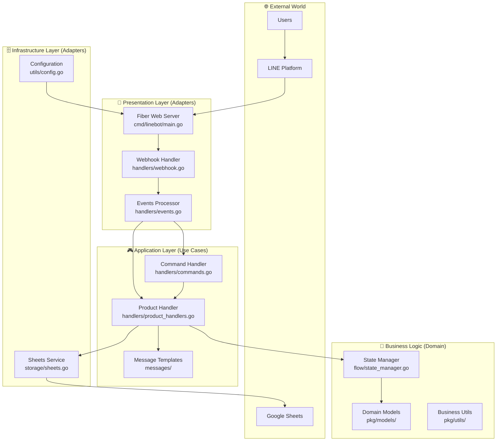

#  เราจะมาทำการเพิ่ม Case ลงไปใน BotLine : เวนส์เดย์
> ปัจจุบันเรามีการทำ Case สำหรับการเพิ่ม `อัพเดทอลูมิเนียม` ลงไปเพื่อการอัพเดท Stock ของอลูมิเนียม
> แต่เรายังไม่มีการทำ Get Stock ทั้งหมดลงไป เราจึงทำการสร้าง Case ใหม่ที่ชื่อว่า `สต็อกอลูมืเนียม` โดยจะมี Handler รับ Case จาก `commands`


### TL;DR

สร้าง Handler method โดยเรียกใช้ผ่าน Event ที่ pointer ไปที่ Field ของ Command จากนั้นให้ไปแก้ไข webhook เพื่อเพิ่ม parameter ของ stockHandler ลงไป

**สร้างตามลำดับ layer:
Data → Business → Command → Main**

ยังไม่ได้ทำ Flexcard Return

----
### Project Architecture

**Clean Architecture**


----


### **Step 1: Sheet Setup"**
	เริ่มจากการสร้างไฟล์เพื่อจัดการข้อมูลจาก sheet ให้สร้าง `./storage/get_stock.go` เป็น external Adaptor โดยรายละเอียดภายใน : 
```go
package storage

import (
	"fmt"
	"strings"
)

// ฟังก์ชันนี้ใช้ดึงข้อมูลสต็อกอลูมิเนียมจาก Google Sheet ที่ระบุ
func (s *SheetsService) GetAluminumStock(text string) ([][]interface{}, error) {
	// กำหนดชื่อชีตที่จะดึงข้อมูล
	// ถ้าไม่มีการระบุชื่อชีตมา จะใช้ "ชื่อ sheet ที่ต้องการ" เป็นค่าเริ่มต้น
	sheetName := strings.TrimSpace(text)
	// หากเกิดข้อผิดพลาดอะไรตอน trims ก็ให้ใช้ค่า `ชื่อ sheet ที่ต้องการ` เป็น default ไปเลย
	if sheetName == "" {
		sheetName = "ชื่อ sheet ที่ต้องการ"
	}

	// ใช้คำสั่งนี้เพื่อดึงข้อมูลทั้งหมดจาก Google Sheet
	// โดยใช้ ID ของสเปรดชีต (spreadsheetID) และชื่อชีต (sheetName) ที่เรากำหนดไว้
	stock, err := s.service.Spreadsheets.Values.Get(
		s.spreadsheetID, sheetName,
	).Do() // .Do() คือคำสั่งที่ใช้รันการดึงข้อมูลจริง ๆ
	if err != nil {
		// ถ้ามีข้อผิดพลาดในการดึงข้อมูล จะส่งข้อความแจ้งเตือนกลับไป
		return nil, fmt.Errorf("failed to get values from sheet %s: %w", sheetName, err)
	}

	// ถ้าไม่มีข้อผิดพลาด ก็จะส่งข้อมูลทั้งหมดที่ดึงมาได้กลับไป
	return stock.Values, nil
}

```
**อธิบายการทำงาน**:
โค้ดด้านบนมี Spreadsheets.Values.Get() ซึ่งเป็นคำสั่งสำคัญที่ใช้ดึงข้อมูล โดยมันจะเรียกข้อมูลจาก sheetId ที่เราได้ตั้งค่าไว้ในไฟล์ .env เพื่อดึงข้อมูลทั้งหมดออกมา

หลังจากที่เราสร้างฟังก์ชัน `GetAluminiumStock()` นี้แล้ว เราก็จะนำไปใช้กับส่วนจัดการคำขอ (Handler) ต่อไป

----

### **Step 2: Handler** (Business Logic)

##### StockHandler
**let's create new package in: `./internals/handlers/`**
> the process of this function is 

```go
package handlers

import (
	"fmt"
	"log/slog"
	"wednesday-need-service/internal/storage"

	"github.com/line/line-bot-sdk-go/v7/linebot"
)
// สร้าง struct เอาไว้สำหรับ return ใน NewStockHandler
type StockHandler struct {
	// pointer กลับไปที่ sheet ที่เพิ่งสร้างขึ้นมา
	sheets *storage.SheetsService
	// เอาไว้ log
	logger *slog.Logger
	// สร้าง client
	bot    *linebot.Client
}

// สร้าง New Handler ไว้ทำหรับ initialize service นี้
func NewStockHandler(sheets *storage.SheetsService, logger *slog.Logger, bot *linebot.Client) *StockHandler {
	return &StockHandler{
		sheets: sheets,
		logger: logger,
		bot:    bot,
	}
}

// Handler สำหรับเรียกใช้ใน command 
func (h *StockHandler) HandleAluminumStock(text string, event *linebot.Event) error {
	stock, err := h.sheets.GetAluminumStock(text)
	if err != nil {
		h.logger.Error("Failed to get aluminum stock", "error", err)
		return err
	}

// ถ้าหากทำ flexcards ก็ให้ reply ลงไปตรงนี้้ แต่ตอนนี้ยังไม่ได้ทำครับบบ
	message := linebot.NewTextMessage(fmt.Sprintf("%v", stock))

// ถ้าหาก error ก็พ่นออกมาที่นี่
	if _, err := h.bot.ReplyMessage(event.ReplyToken, message).Do(); err != nil {
		h.logger.Error("Failed to send aluminum stock message", "error", err)
		return err
	}

// return `nil` !!!!!
	return nil
}
```
**อธิบายการทำงาน**:
 - สร้าง struct ของ stockHandler สำหรับการ initialize service ด้วย
 - NewStockHandler และสร้าง func HandleAluminumStock เพื่อการเรียกใช้ใน command 
   ตัว Handler มีหน้าที่รับ text มาจาก event ของ bot ซึ่งจะมีค่าเท่ากับ sheet name ที่กำหนดไว้ใน config และ return กลับ`message`ไปด้วย `h.bot.ReplyMessage(event.ReplyToken, message).Do()` แต่ว่าอย่าลืมประกาศ err ด้วย หาก != nil ก็ให้ return h.logger.Error("msg", "error", err)

##### commands
นำ handler ที่เพิ่งสร้างมาทำงาน ที่ ำ`./internal/bot/handlers/commands.go`
```go
package handlers

import (
	"github.com/line/line-bot-sdk-go/v7/linebot"
)

type CommandHandler struct {
	stockHandler   *StockHandler
//  ^^^^^^^^^^^^^^^^^^^^^^^^^^^ field ลงใน CommandHandler
}

func NewCommandHandler(stockHandler *StockHandler) *CommandHandler {
	return &CommandHandler{
		stockHandler:   stockHandler,
//  ^^^^^^^^^^^^^^^^^^^^^^^^^^^ เพิ่ม Field return ของ &CommandHandler
	}
}

func (c *CommandHandler) HandleCommand(text string, event *linebot.Event) error {
	switch text {
//	..
//	.
//	.
//	.
	case "สต็อกอลูมิเนียม":
		return c.stockHandler.HandleAluminumStock(text, event)
//  ^^^^^^^^^^^^^^^^^^^^^^^^^^^ เพิ่ม case เมื่อ event มีค่า = case
//	.
//	.
//	.
	}
}
```

> กลับในที่ `./cmd/linebot/main.go` เพิ่ม `NewStockHandler` ลงไป

```go
package main

import (.....)
//
//	...
//	...
//	..
//	.
//	.
//	.
	stockHandler := handlers.NewStockHandler(sheets,slogger,bot)

	slogger.Info("Stock handler initialized")
	app.Post("/wednesday",handlers.WebhookHandler(bot,slogger,stockHandler))

//	...
//	..
//	.
//	.
//	.
```
**อธิบายการทำงาน :**
สร้าง Instance ของ StockHandler โดยส่ง Google Sheets service, logger, และ LINE Bot client เข้าไป

จากนั้นส่งไปที่ `webhookHandler` สำหรับเรียกใช้งาน API `app.Post("/wednesday", handlers.WebhookHandler(bot, slogger, config, productHandler, stockHandler))` 

ที่ `handler.WebhookHandler()` จะทำการส่งค่าไปที่ `EventProcessor` ที่ได้ทำการสร้างไว้สำหรับแยก case ต่างๆ ไว้

##### Webhook
```go
package handlers

import (
	"log/slog"
	"time"
	"wednesday-need-service/pkg/models"

	"github.com/gofiber/fiber/v2"
	"github.com/line/line-bot-sdk-go/v7/linebot"
)

// WebhookHandler
func WebhookHandler(bot *linebot.Client, logger *slog.Logger, productHandler *ProductHandler, stockHandler *StockHandler) fiber.Handler {
	return func(c *fiber.Ctx) error {
		// Get raw body for logging
		body := c.Body()
		logger.Info("Webhook received", "size", len(body))

		// Process events using the events processor
		eventsProcessor := NewEventsProcessor(bot, logger, productHandler, stockHandler)
		return eventsProcessor.ProcessWebhook(c)
	}
}
```
เมื่อ WebhookHandler เริ่มทำงาน จะทำการสร้าง `NewEventProcessor` ผ่านการทำงานของ `eventsProcessor.ProcessWebhook(c)` 

##### eventProcessor
```go
package handlers

import (
	"encoding/json"
	"log/slog"

	"github.com/gofiber/fiber/v2"
	"github.com/line/line-bot-sdk-go/v7/linebot"
)

// EventsProcessor handles LINE event processing
type EventsProcessor struct {
	bot            *linebot.Client
	logger         *slog.Logger
	productHandler *ProductHandler
	commandHandler *CommandHandler
}

// NewEventsProcessor creates a new events processor
func NewEventsProcessor(bot *linebot.Client, logger *slog.Logger, stockHandler *StockHandler) *EventsProcessor {
	return &EventsProcessor{
		bot:            bot,
		logger:         logger,
		commandHandler: NewCommandHandler(anotherHandler, stockHandler),
	}
}
// ProcessWebhook processes webhook events with signature verification
func (e *EventsProcessor) ProcessWebhook(c *fiber.Ctx) error {
	// For now, fall back to debug processing (no signature verification)
	// TODO: Implement proper signature verification
	return e.Process(c)
}

func (e *EventsProcessor) Process(c *fiber.Ctx) error {
	var webhookBody struct {
		Events []json.RawMessage `json:"events"`
	}

	if err := c.BodyParser(&webhookBody); err != nil {
		e.logger.Error("Failed to parse JSON body", "error", err)
		return c.Status(fiber.StatusBadRequest).JSON(fiber.Map{"error": "Invalid JSON"})
	}

	e.logger.Info("Parsed events", "count", len(webhookBody.Events))

	// ส่ง Event ไปทำงานกับ StockHandler ตรงนี้
	for _, eventData := range webhookBody.Events {
		e.logger.Info("Event received", "data", string(eventData))

		if err := e.processEvent(eventData); err != nil {
			e.logger.Error("Failed to process event", "error", err)
			continue
		}
	}

	return c.JSON(fiber.Map{"status": "ok-no-signature"})
}

// processEvent processes a single LINE event
func (e *EventsProcessor) processEvent(eventData json.RawMessage) error {
	// Parse individual event
	var eventMap map[string]interface{}
	if err := json.Unmarshal(eventData, &eventMap); err != nil {
		return err
	}

	// Check event type
	eventType, ok := eventMap["type"].(string)
	if !ok {
		e.logger.Warn("No event type found")
		return nil
	}

	// Get reply token and user ID
	replyToken, _ := eventMap["replyToken"].(string)
	var userID string
	if source, ok := eventMap["source"].(map[string]interface{}); ok {
		userID, _ = source["userId"].(string)
	}

	e.logger.Info("Processing event", "type", eventType, "user_id", userID)

	// Handle different event types
	switch eventType {
	case "message":
		return e.handleMessageEvent(eventMap, replyToken, userID)
	case "postback":
		return e.handlePostbackEvent(eventMap, replyToken, userID)
	default:
		e.logger.Info("Unhandled event type", "type", eventType)
		return nil
	}
}

// handleMessageEvent handles text message events
func (e *EventsProcessor) handleMessageEvent(eventMap map[string]interface{}, replyToken, userID string) error {
	messageData, ok := eventMap["message"].(map[string]interface{})
	if !ok {
		return nil
	}

	msgType, _ := messageData["type"].(string)
	if msgType != "text" {
		return nil
	}

	text, _ := messageData["text"].(string)
	if text == "" {
		return nil
	}

	e.logger.Info("Text message received", "text", text)

	// Create a simple event structure for handlers
	fakeEvent := &linebot.Event{
		Type: linebot.EventTypeMessage,
		Source: &linebot.EventSource{
			UserID: userID,
		},
		ReplyToken: replyToken,
		Message: &linebot.TextMessage{
			Text: text,
		},
	}

	// Check if user has pending entry (waiting for quantity)
	if _, exists := e.productHandler.GetStateManager().GetPendingEntry(userID); exists {
		// Handle quantity input
		if textMsg, ok := fakeEvent.Message.(*linebot.TextMessage); ok {
			return e.productHandler.HandleQuantityInput(fakeEvent, textMsg)
		}
	}

	// Handle commands when no pending entry
	return e.commandHandler.HandleCommand(text, fakeEvent)
}

// handlePostbackEvent handles postback events
func (e *EventsProcessor) handlePostbackEvent(eventMap map[string]interface{}, replyToken, userID string) error {
	postbackData, ok := eventMap["postback"].(map[string]interface{})
	if !ok {
		return nil
	}

	data, _ := postbackData["data"].(string)
	if data == "" {
		return nil
	}

	e.logger.Info("Postback received", "data", data)

	// Create a simple event structure for handlers
	fakeEvent := &linebot.Event{
		Type: linebot.EventTypePostback,
		Source: &linebot.EventSource{
			UserID: userID,
		},
		ReplyToken: replyToken,
		Postback: &linebot.Postback{
			Data: data,
		},
	}

	// Handle product selection
	return e.productHandler.HandleProductSelection(fakeEvent)
}

```
รับ `webhook` จาก LINE  แปลง JSON เป็น Go data และแยกประเภท event
ถ้าเป็น text message → handleMessageEvent() เช็ค user state แล้วส่งไป commandHandler หรือ productHandler
แต่หากเป็นการกดปุ่ม
`handlePostbackEvent()` ส่งไป `anotherHandler` ทันที
แต่ละ function สร้าง fakeEvent → แปลงข้อมูล LINE ให้เป็นรูปแบบที่ handlers เข้าใจ
ส่ง "ok" กลับ LINE → ยืนยันว่าประมวลผลเสร็จแล้ว

----
